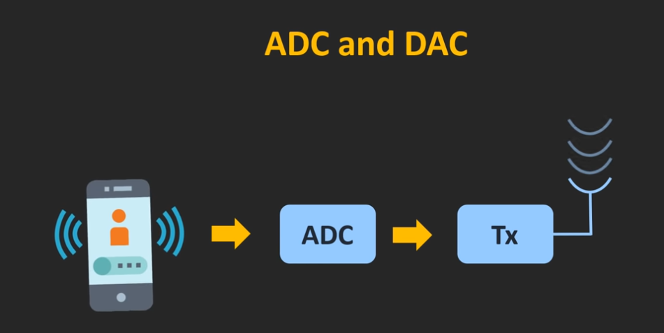
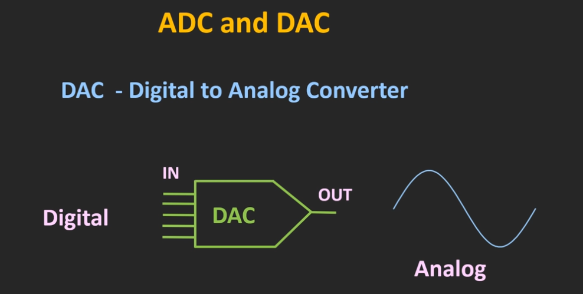
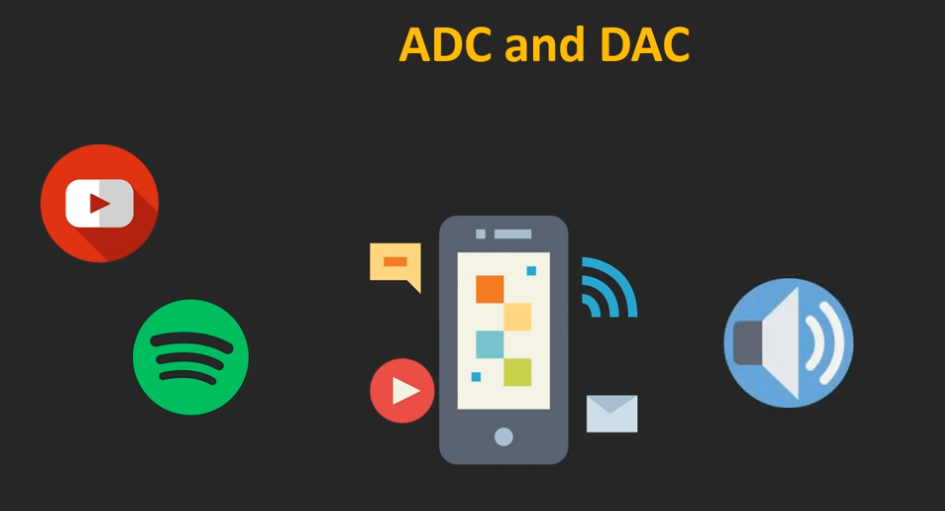

# ADC

### Příklad využití ADC
Když mluvíme po telefonu, mikrofon převádí náš hlas na elektrický signál a pomocí ADC je tento signál digitalizován a je přenášen ve formě rádiových vln.

# DAC

### Příklad využití DAC
Když streamujeme hudbu na našem smartphonu, pak se tento digitální bitový tok převede na elektrický signál a prostřednictvím reproduktoru smartphonu jsme schopni tuto hudbu slyšet.
