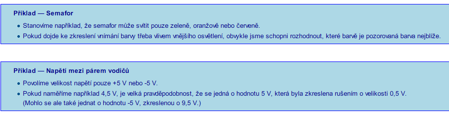
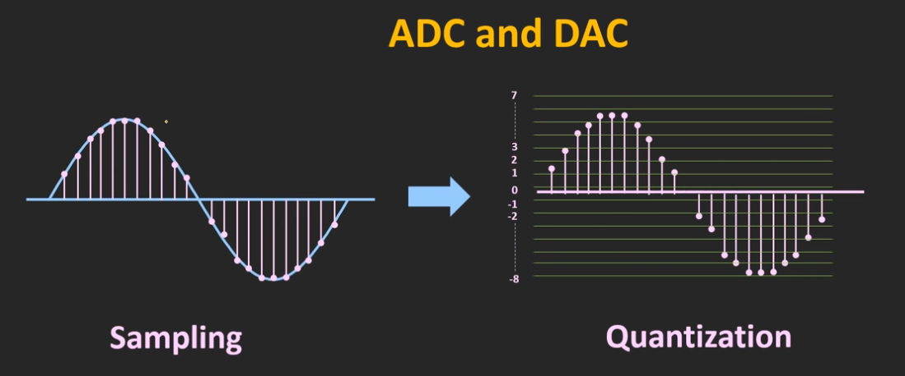
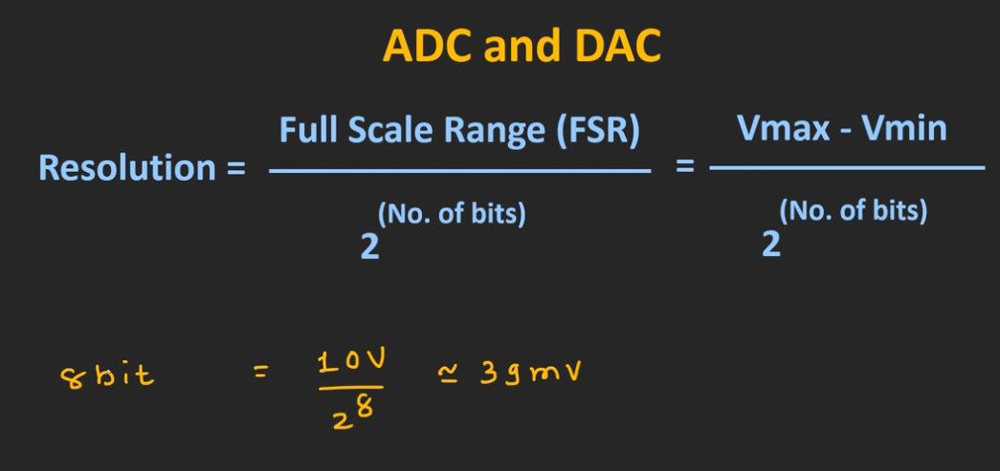
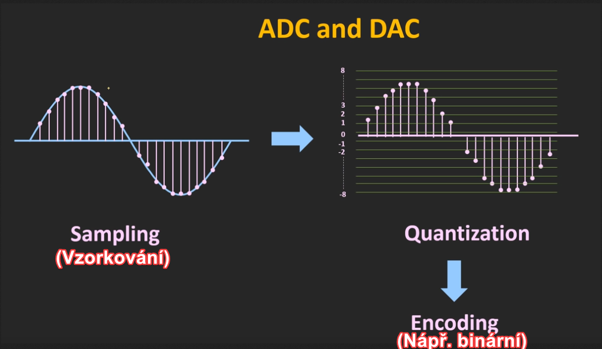

# 2 typy signálu
analogový signál = hodnota se přenáší jako úroveň napětí či proudu
digitální signál = hodnota je zakódována jako binární číslo
### Analogový přenos
Libovolná hodnota signálu je platná, s časem se hodnota mění postupně (spojitě). 
+ Jednoduchost
+ Efektivita →  v jednom okamžiku můžeme přenášet teoreticky nekonečně mnoho informace (ve skutečnosti jsme omezeni přesností měření a mírou šumu — rušení) 
- Nelze detekovat chybu (rušení signálu)
- Nelze opravit vzniklé zkreslení
### Digitální přenos
Vyhradíme pouze několik hodnot signálu, které jsou povolené. 
Výskyt jiných hodnot indikuje chybu při přenosu (porušení přenášeného signálu). 

Můžeme chybu „opravit“:
    1)Zaokrouhlíme ji na nejbližší platnou hodnotu.
    2)Často tak získáme správnou (odvysílanou) hodnotu (ale ne vždy)! 

### Kvantování
V konstantních časových intervalech se odebírají vzorky, kterým se přiřazuje úměrná hodnota.

Jak zde vidíte, signál je kvantován v 16 různých úrovních a vzorkovanému signálu je přiřazena nejbližší hodnota z těchto 16 úrovní.
#### Vypočítání rozlišovací schopnosti ( V kolika urovních se bude kvantovat)

#### Vypočítání minimální změny, kterou lze detekovat pomocí ADC

Takže tento 8bitový ADC bude nyní schopen detekovat změnu už dokonce při 39 mV.

Stručně řečeno, zvýšením počtu bitů můžeme zvýšit rozlišovací schopnost.
# ADC

### Příklad využití
Když mluvíme po telefonu, mikrofon převádí náš hlas na elektrický signál a pomocí ADC je tento signál digitalizován a je přenášen ve formě rádiových vln.

Podobně, na straně přijímače, s použitím DAC jsou tato přijímaná digitální data převedena na analogový signál a prostřednictvím reproduktoru jsme schopni slyšet hlas jiné osoby.
### Proces konvertování ANALOG na DIGITALNÍ

# DAC

### Příklad využití DAC
Když streamujeme hudbu na našem smartphonu, pak se tento digitální bitový tok převede na elektrický signál a prostřednictvím reproduktoru smartphonu jsme schopni tuto hudbu slyšet.
.... zde tento DAC uvnitř smartphonu převádí digitální bitový proud na analogový signál.
