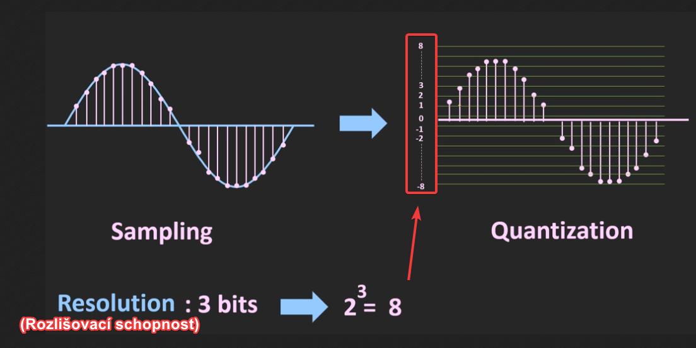
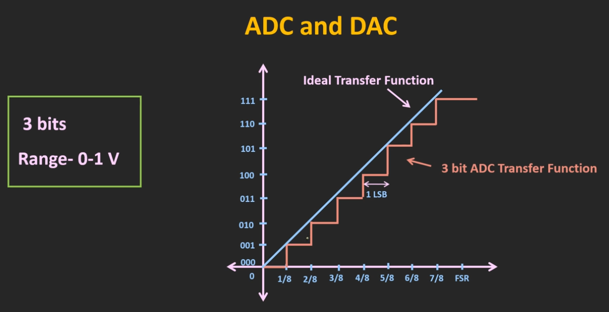
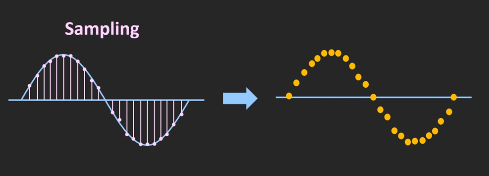

# 2 typy signálu
analogový signál = hodnota se přenáší jako úroveň napětí či proudu

digitální signál = hodnota je zakódována jako binární číslo
### Analogový přenos
Libovolná hodnota signálu je platná, s časem se hodnota mění postupně (spojitě). 
+ Jednoduchost
+ Efektivita →  v jednom okamžiku můžeme přenášet teoreticky nekonečně mnoho informace (ve skutečnosti jsme omezeni přesností měření a mírou šumu — rušení) 
- Nelze detekovat chybu (rušení signálu)
- Nelze opravit vzniklé zkreslení
### Digitální přenos
Vyhradíme pouze několik hodnot signálu, které jsou povolené. 
Výskyt jiných hodnot indikuje chybu při přenosu (porušení přenášeného signálu). 

Můžeme chybu „opravit“:
    1)Zaokrouhlíme ji na nejbližší platnou hodnotu.
    2)Často tak získáme správnou (odvysílanou) hodnotu (ale ne vždy)! 

# ADC

### Příklad využití
Když mluvíme po telefonu, mikrofon převádí náš hlas na elektrický signál a pomocí ADC je tento signál digitalizován a je přenášen ve formě rádiových vln.

Podobně, na straně přijímače, s použitím DAC jsou tato přijímaná digitální data převedena na analogový signál a prostřednictvím reproduktoru jsme schopni slyšet hlas jiné osoby.
### Proces konvertování ANALOG na DIGITALNÍ

## Kvantování
V konstantních časových intervalech se odebírají vzorky, kterým se přiřazuje úměrná hodnota.

Jak zde vidíte, signál je kvantován v 16 různých úrovních a vzorkovanému signálu je přiřazena nejbližší hodnota z těchto 16 úrovní.
#### Vypočítání rozlišovací schopnosti ( V kolika urovních se bude kvantovat)

#### Vypočítání minimální změny, kterou lze detekovat pomocí ADC

Takže tento 8bitový ADC bude nyní schopen detekovat změnu už dokonce při 39 mV.

Stručně řečeno, zvýšením počtu bitů můžeme zvýšit rozlišovací schopnost.
### Jak bude vypadat graf

Tento graf tedy ukazuje přenosovou funkci 3bitového ADC s plným rozsahem 1V.
Jak vidíte, tato přenosová funkce vypadá jako schodiště.

A modrá čára ukazuje ideální přenosovou funkci ADC.
To znamená, že pokud je rozlišení ADC nekonečné, pak by přenosová funkce vypadala jako přímka.
#### Vysvětlení pojmu LSB na tomto grafu
Pro toto 3bitové ADC bude minimální detekovatelné napětí nebo rozlišení rovné (1Volt)/(2 na 3) = 0,125V

Což znamená, že kdykoli je vstupní napětí mezi 0 a 0,125V, pak bude považováno za nulu.

A výstup ADC se změní, pouze pokud vstup přesáhne tento 0,125V.

Takže díky tomuto procesu kvantování bude chyba zavedena do výstupu ADC.

Tato chyba se nazývá Kvantizační chyba = 1 LSB (Least significant bit)

Vidíte ve grafu funkce přenosu, že každý krok odpovídá 1 LSB.

Tuto kvantizační chybu lze samozřejmě snížit zvýšením počtu bitů.
## Vzorkování

Jak vidíte, čím více vzorku odebíráme, tím přesněji můžeme reprezentovat analogový signál.

Podle Nyquistovy věty o vzorkování, by vzorkovací frekvence měla být alespoň dvojnásobkem maximální frekvence vstupního signálu.
Proč?
Aby signál mohl po vzorkování být rekonstruován(převeden zpátky na analogový).

Pro sinusovou vlnu s maximální frekvencí f max by tedy minimální vzorkovací frekvence měla být rovna 2násobku fmax.

Při použití nižší vzorkovací frekvence se po převodu zpátky na analogový signál mohou v důsledku tzv. aliasingu objevit ve výsledném signálu frekvence, které v původním signálu nebyly

Aby se zabránilo tomuto aliasingu: vzorkovací frekvence by měla být alespoň dvojnásobkem maximální frekvence...........

Aliasingu se dá zabránit jedině takzvaným antialiasing filtrem, což je dolní propust zařazená před převodníkem. 
Ta nedovolí frekvencím vyšším než je Nyquistova frekvence vstoupit do převodníku. 
# DAC

### Příklad využití DAC
Když streamujeme hudbu na našem smartphonu, pak se tento digitální bitový tok převede na elektrický signál a prostřednictvím reproduktoru smartphonu jsme schopni tuto hudbu slyšet.
.... zde tento DAC uvnitř smartphonu převádí digitální bitový proud na analogový signál.
